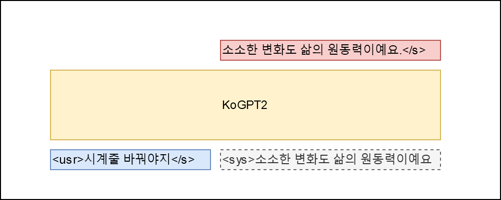

# Simple Chit-Chat based on KoGPT2

## Purpose

- [공개된 한글 챗봇 데이터](https://github.com/songys/Chatbot_data)와 pre-trained [KoGPT2](https://github.com/SKT-AI/KoGPT2)를 이용한 간단한 챗봇 실험
- `KoGPT2`의 다양한 활용 가능성을 타진하고 성능을 정성적으로 평가한다.

## Architecture

학습 데이터에 적합하게 [Hello! GPT-2](https://arxiv.org/abs/1907.05774)를 응용, 아래와 같은 아키텍처를 설계함




- 데이터의 Q 필드를 `<usr>`발화, A 필드를 `<sys>`발화 그리고 감정 레이블을 `<sent>`로 매핑해 `P(<sys>|<usr>, <sent>)`를 최대화 할 수 있는 모델을 학습한다. 감정 레이블은 [이곳](https://github.com/songys/Chatbot_data)의 정의를 따른다(일상다반사 0, 이별(부정) 1, 사랑(긍정) 2).

## Install


```bash
git clone --recurse-submodules https://github.com/haven-jeon/KoGPT2-chatbot.git
cd KoGPT2-chatbot
pip3 install -r requirements.txt 
```

## How to Train

```bash
CUDA_VISIBLE_DEVICES=0 python train_torch.py --gpus 1 --train --max_epochs 2
```

## How to Chat!

```bash
# CUDA_VISIBLE_DEVICES=0 python train.py --chat
CUDA_VISIBLE_DEVICES=0 python train_torch.py --gpus 1 --chat
user > 대박 
Simsimi > 잘 될 거예요.

user > 너 이름이 뭐니?
Simsimi > 저는 위로봇입니다.

user > 어버이날엔 뭘 하죠?
Simsimi > 저랑 놀아요.

user > 비가와
Simsimi > 우산 챙기세요.

user > 눈이와
Simsimi > 눈사람 만들어보세요.

user > 천둥이 쳐
Simsimi > 저도 보고 싶어요.

user > 봄이왔어.
Simsimi > 봄은 항상 두근거려요.

user > 배탈났어.
Simsimi > 얼른 집에 가서 쉬세요.

user > 너를 만든 사람은?
Simsimi > 당신이 만든 사람이에요.
```

## Colab tutorials

- PyTorch
  - [](https://colab.research.google.com/github/haven-jeon/KoGPT2-chatbot/blob/master/KoGPT2_chatbot_pytorch.ipynb)

